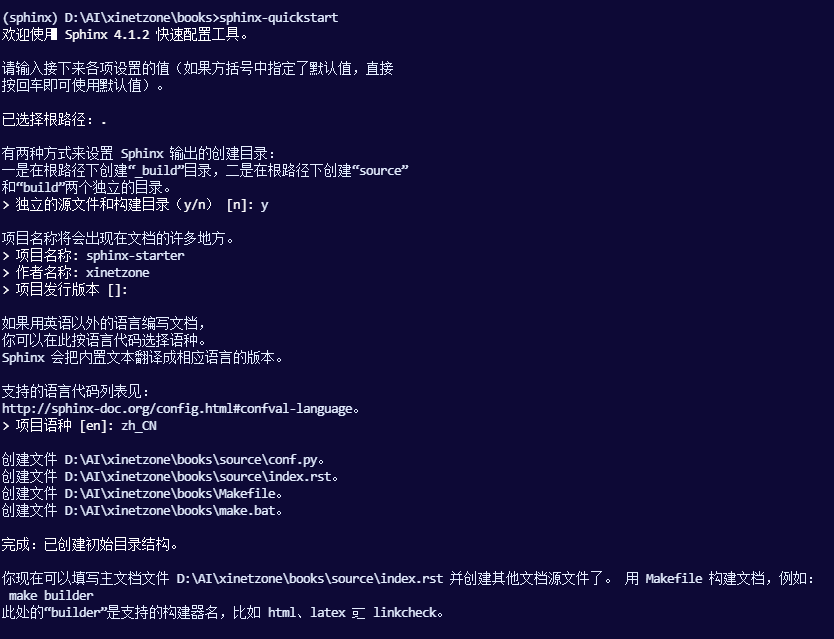
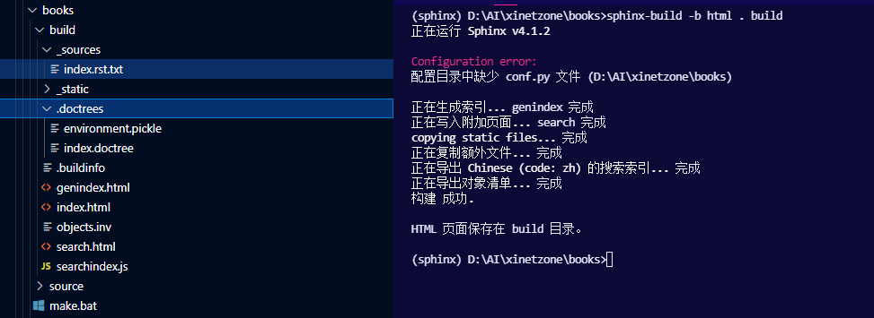

# 快速上手

安装（详细见：[Installing Sphinx](https://www.sphinx-doc.org/zh_CN/master/usage/installation.html)）Sphinx：

```sh
pip install -U Sphinx
```

## 设置文档源

Sphinx 的纯文本文件源集合的根目录被称为**源目录**（[source directory](https://www.sphinx-doc.org/zh_CN/master/glossary.html#term-source-directory)）。该目录还包含 Sphinx 配置文件 `conf.py`，用于配置 Sphinx 如何读取源代码和构建文档。[^1]

Sphinx 附带一个名为 `sphinx-quickstart` 的脚本，它设置一个源目录并创建一个默认的 `conf.py`，其中包含几个问题中最有用的配置值。要使用它，请运行：

```sh
sphinx-quickstart
```



## 定义文档结构

`sphinx-quickstart` 生成的源目录结构如下：


它创建了一个带有 `conf.py` 的源目录和一个根文件 `index.rst`。[根文件](https://www.sphinx-doc.org/zh_CN/master/glossary.html#term-root-document)的主要功能是作为一个欢迎页，并包含 "目录树"（或 `toctree`）的根。这是 Sphinx 为 reStructuredText 增加的主要内容之一，这是一种将多个文件连接到单一层次的文件的方法。

````{margin}
`toctree` 指令最初是空的，看起来像这样：

```rst
.. toctree::
   :maxdepth: 2
```

你添加的文件在指令的**内容**中列出了它们。

```rst
.. toctree::
   :maxdepth: 2

   usage/installation
   usage/quickstart
   ...
```

这正是这个文档的 `toctree` 的样子。要包括的文件是以[文件名](https://www.sphinx-doc.org/zh_CN/master/glossary.html#term-document-name)的形式给出的，简而言之，这意味着你省去了文件名的扩展名，用正斜杠（`/`）作为目录分隔符。
````

`toctree` 是一个 reStructuredText 指令，一个非常通用的标记。你现在可以在 `toctree` 中创建你列出的文件并添加内容，他们的章节标题将被插入（最大深度级别）在 `toctree` 指令放置的地方。另外，Sphinx 现在知道了你的文件的顺序和层次结构（它们本身可能包含 `toctree` 指令，这意味着你可以在必要时创建深度嵌套的层次结构）。

## 添加内容

在 Sphinx 源文件中，您可以使用标准的大多数功能 reStructuredText 。Sphinx 还增加了一些功能。例如，您可以使用 [`ref`](https://www.sphinx-doc.org/zh_CN/master/usage/restructuredtext/roles.html#role-ref) 角色以可移植的方式（适用于所有输出类型）添加跨文件引用。

## 运行构建

现在您已经添加了一些文件和内容，让我们首先构建文档。使用 `sphinx-build` 程序启动构建：

```sh
sphinx-build -b html sourcedir builddir
```

其中 `sourcedir` 是源目录，`builddir` 是您要在其中放置构建文档的目录。`-b` 选项选择一个构建器；在这个例子中，`Sphinx` 将构建 HTML 文件。



请参考 [`sphinx-build` 手册](https://www.sphinx-doc.org/zh_CN/master/man/sphinx-build.html)，了解 `sphinx-build` 支持的所有选项。

但是，`sphinx-quickstart` 脚本创建了一个 `Makefile` 和一个 `make.bat`，它让你的生活更加轻松。这些可以通过运行 `make` 来执行，其中包含构建器的名称。例如：

```sh
make html
```

## 文档对象

Sphinx 的主要目标之一是方便记录任何**域**中的对象（在一个非常普遍的意义上）。一个**域**是属于一起的对象类型的集合，有完整的标记来创建和引用这些对象的描述。

最突出的域是 Python 域。例如，要记录 Python 的内置函数 `enumerate()`，可以将其添加到您的一个源文件中。

````{panels}
:container: w3-card-4 w3-pale-green w3-padding
:column: col-lg-6 px-2 py-2
---
:header: w3-pale-blue
RST
^^^
```rst
.. py:function:: enumerate(sequence[, start=0])

   Return an iterator that yields tuples of an index and an item of the
   *sequence*. (And so on.)
```
---
:header: w3-pale-red
渲染：
^^^
```{eval-rst}
.. py:function:: enumerate(sequence[, start=0])

   Return an iterator that yields tuples of an index and an item of the
   *sequence*. (And so on.)
```
````

该指令的参数是你描述的对象的 signature ，内容是它的文档。可以给出多个签名，每个签名都在其自己的行中。

Python 域也恰好是默认域，因此您不需要在标记前加上域名。

```rst
.. function:: enumerate(sequence[, start=0])

   ...
```

如果保留默认域的默认设置，则执行相同的工作。

还有几个用于记录其他类型的Python对象的指令，例如 [`py:class`](https://www.sphinx-doc.org/zh_CN/master/usage/restructuredtext/domains.html#directive-py:class) 或 [`py:method`](https://www.sphinx-doc.org/zh_CN/master/usage/restructuredtext/domains.html#directive-py:method)。对于每种对象类型，还有一个交叉引用 role。这个标记将创建一个指向 `enumerate()` 文档的链接。

````{panels}
:container: w3-card-4 w3-pale-green w3-padding
:column: col-lg-6 px-2 py-2
---
:header: w3-pale-blue
RST
^^^
```rst
The :py:func:`enumerate` function can be used for ...
```
---
:header: w3-pale-red
渲染：
^^^
```{eval-rst}
The :py:func:`enumerate` function can be used for ...
```
````

同样，如果 Python 域是默认域，则可以省略 `py:`。哪个文件包含 `enumerate()` 的实际文档并不重要；Sphinx 会找到它并创建一个链接。

每个域都有特殊的规则来表示签名的外观，并使格式化的输出看起来很漂亮，或添加特定的功能，如链接到参数类型，例如在 C/C ++ 域中。

```{note}
请参阅 [域](https://www.sphinx-doc.org/zh_CN/master/usage/restructuredtext/domains.html)，了解所有可用域及其指令/角色。
```

## 基本配置

之前我们提到过 `conf.py` 文件控制着 Sphinx 处理文档的方式。在该文件中，它作为 Python 源文件执行，您可以分配配置值。对于高级用户：由于它是由 Sphinx 执行的，因此您可以在其中执行非平凡的任务，例如扩展 `sys.path` 或导入模块以找出您正在记录的版本。

您可能想要更改的配置值已经放入 `conf.py` 由 `sphinx-quickstart` 并且最初被注释掉（使用标准的 Python 语法: `#` 注释其余的这行）。要更改默认值，请删除 `#` 并修改该值。要自定义一个不会自动添加的配置值 `sphinx-quickstart`，只需添加一个额外的赋值。

请记住，该文件使用 Python 语法来表示字符串，数字，列表等。默认情况下，文件以 UTF-8 保存，如第一行中的编码声明所示。如果在任何字符串值中使用非 ASCII 字符，则需要使用 Python Unicode 字符串（如 `project =u'Exposé'`）。

## 使用 `autodoc` 自动生成文档

在记录 Python 代码时，通常会在文档字符串中的源文件中放入大量文档。Sphinx 支持在模块中包含 docstrings extension（扩展名是为 Sphinx 项目提供附加功能的 Python 模块），称为 `autodoc`。

为了使用 `autodoc`，你需要在 `conf.py` 中激活它，方法是将字符串 `'sphinx.ext.autodoc'` 放入分配给 [`extensions`](https://www.sphinx-doc.org/zh_CN/master/usage/configuration.html#confval-extensions) 配置的列表中值。然后，您可以使用其他一些指令。

例如，要记录函数 `io.open()`，从源文件中读取它的签名和 docstring，你就写下：

```rst
.. autofunction:: io.open
```

您还可以使用 `auto` 指令的成员选项自动记录整个类甚至模块，例如：

```rst
.. automodule:: io
   :members:
```

`autodoc` 需要导入您的模块才能提取文档字符串。因此，您必须在 `conf.py` 中添加适当的路径 `sys.path`。

```{warning}
`autodoc` 导入 要记录的模块。如果任何模块对导入有副作用，那么当运行 `sphinx-build` 时，这些将由 `autodoc` 执行。

如果您记录脚本（而不是库模块），请确保它们的主例程受 `if __name__ =='__ main __'` 条件的保护。
```

有关 `autodoc` 功能的完整描述，请参阅 [`sphinx.ext.autodoc`](https://www.sphinx-doc.org/zh_CN/master/usage/extensions/autodoc.html#module-sphinx.ext.autodoc)。

## 跨 Sphinx 引用

包括 [Python documentation](https://docs.python.org/3) 在内的许多 Sphinx 文档都在 Internet 上发布。如果要从文档中链接到此类文档，可以使用 [`sphinx.ext.intersphinx`](https://www.sphinx-doc.org/zh_CN/master/usage/extensions/intersphinx.html#module-sphinx.ext.intersphinx)。

为了使用 intersphinx，你需要在 `conf.py` 中激活它，方法是将字符串 `'sphinx.ext.intersphinx'` 放入 [`extensions`](https://www.sphinx-doc.org/zh_CN/master/usage/configuration.html#confval-extensions) 列表并设置 [`intersphinx_mapping`](https://www.sphinx-doc.org/zh_CN/master/usage/extensions/intersphinx.html#confval-intersphinx_mapping) 配置值。

例如，要链接到 Python 库手册中的 `io.open()`，你需要设置 `intersphinx_mapping` 如下：

```rst
intersphinx_mapping = {'python': ('https://docs.python.org/3', None)}
```

现在，您可以编写一个交叉引用，如 ``:py:func:`io.open` ``。任何在当前文档集中没有匹配目标的交叉引用都将在配置的文档集中查找 `intersphinx_mapping`（这需要访问URL才能下载有效目标列表）。Intersphinx 也适用于其他一些 domain 的角色，包括 `:ref:`，但它不适用于 `:doc:`，因为那是非域角色。

有关 intersphinx 功能的完整描述，请参阅 [`sphinx.ext.intersphinx`](https://www.sphinx-doc.org/zh_CN/master/usage/extensions/intersphinx.html#module-sphinx.ext.intersphinx)。

[^1]: 这是普通的布局。但是，`conf.py` 也可以存在于另一个目录中 [configuration directory](https://www.sphinx-doc.org/zh_CN/master/glossary.html#term-configuration-directory)。 有关更多信息，请参阅 [sphinx-build](https://www.sphinx-doc.org/zh_CN/master/man/sphinx-build.html) 手册页 。
